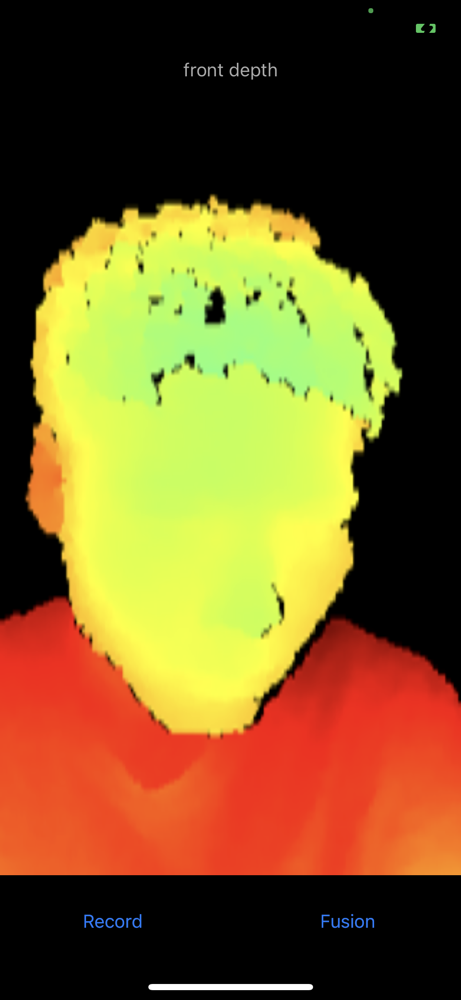
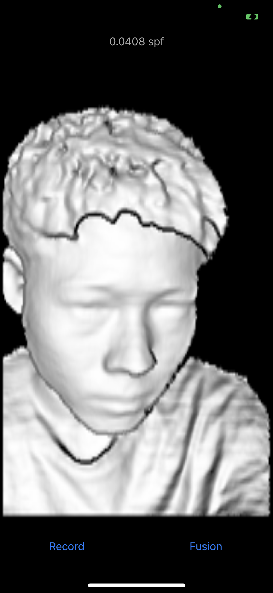
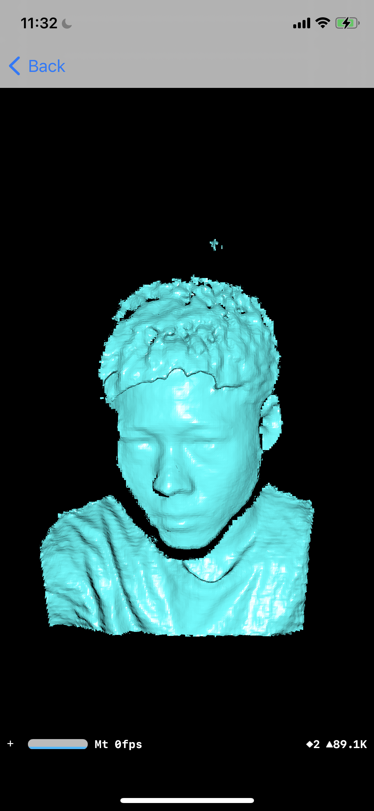
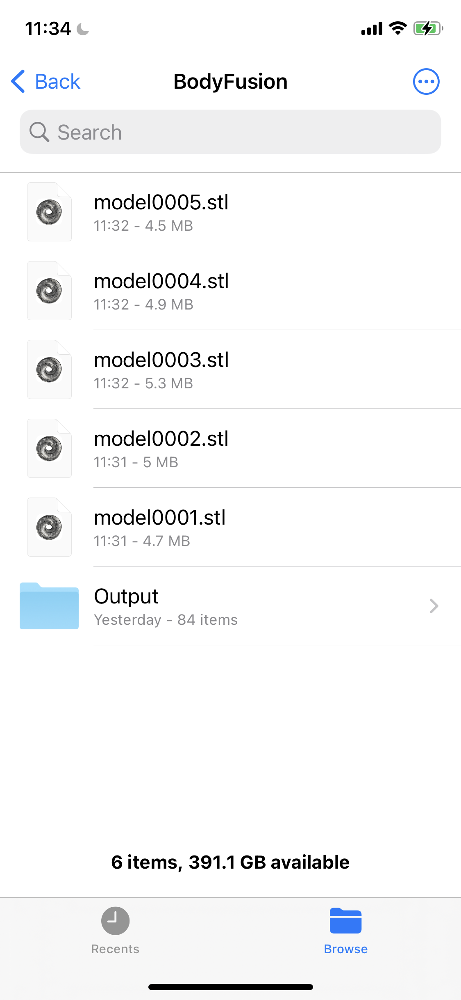

# InfiniTAM_ios

Support depth from iPhone X/XS/XR front TrueDepth camera. Do not support depth from [structure.io](https://developer.structure.io/sdk/) hardware any more.

Written in Objective-C, C++ and Metal. Successfully built on iOS 11+.

The depth frames are shown in pseudo-color. Press "Record" will dump every single depth frame from the sensor, used for debug.
Press "Fusion" button to start reconstruction.

Press "Fusion" again to stop reconstruction and visualize the 3D model.

The STL mesh are saved in Files -> On My iPhone -> BodyFusion.

Each time you open the app and perform reconstructions, it will override these saved files. So you need to export them to other places.

<table>
<tr>
<td>
Depth
</td>
<td>
Fusion
</td>
<td>
Mesh
</td>
<td>
Saved
</td>
</tr>
</table>
